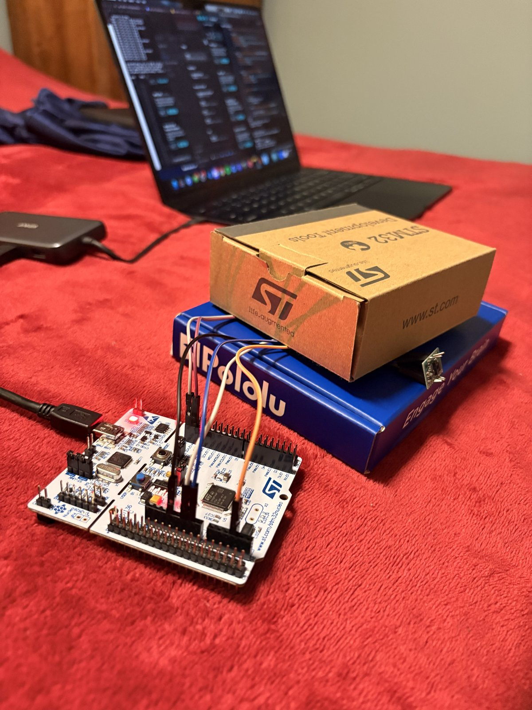
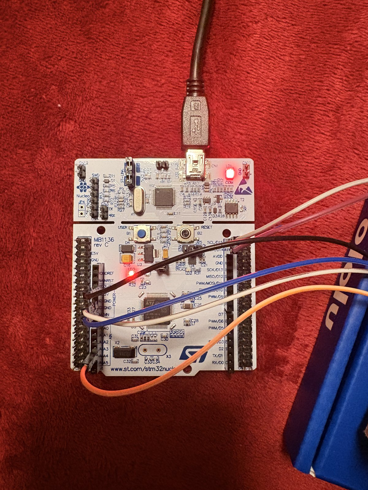
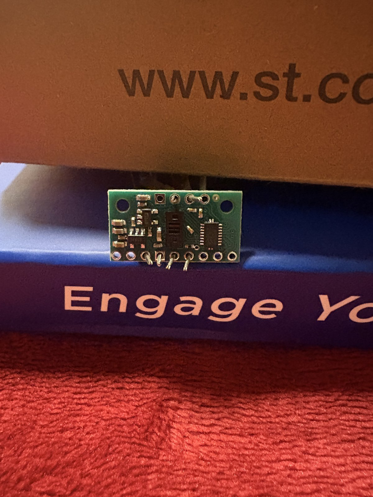
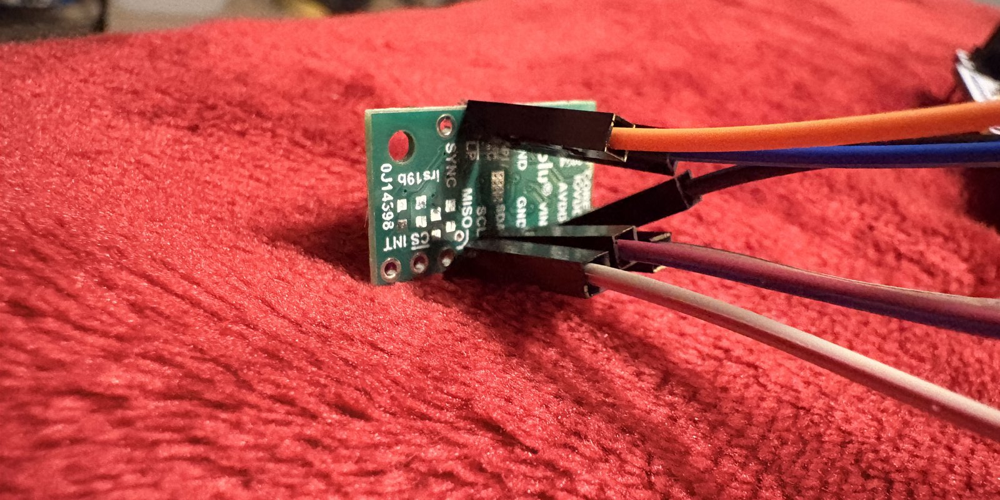

# hands-up


Rock/paper/scissors gesture recognition using an STM32 Nucleo + VL53L8CX
time-of-flight sensor (8x8 depth grid) streamed over serial to a small
PyTorch classifier.

## Layout

- **`esp32_firmware/`** -- Arduino sketch that reads the VL53L8CX over I2C and
  streams one CSV line per frame (64 comma-separated distance values, mm) over
  serial. See the header comment in `esp32_firmware.ino` for wiring and board
  setup (STM32duino core, Nucleo-64, ST-LINK/SWD upload).
- **`scripts/`** -- Python side: data collection, training, and live inference.

## Pipeline (in `scripts/`)

1. **`capture_data.py`** -- live heatmap of the sensor feed with keyboard-driven
   labeled data collection. Records frames into `gesture_dataset.json`.
   ```
   pip install numpy matplotlib pyserial
   python3 capture_data.py
   ```
   Controls (click the plot window first so it has keyboard focus):
   - `r` / `p` / `s` / `e` -- start recording "rock" / "paper" / "scissors" / "empty"
   - `SPACE` -- stop recording
   - `q` -- save dataset and quit

2. **`train_classifier.py`** -- trains a small MLP on `gesture_dataset.json` and
   saves the best checkpoint to `gesture_model.pt`.
   ```
   pip install torch numpy
   python3 train_classifier.py
   ```

3. **`live_demo.py`** -- loads `gesture_model.pt` and prints live predictions +
   confidence as frames come in from the sensor.
   ```
   pip install pyserial torch numpy
   python3 live_demo.py
   ```

## Setup

Each script opens a serial connection to the board at 115200 baud. Edit the
`PORT` constant at the top of `capture_data.py` and `live_demo.py` to match
your device's serial port (e.g. `/dev/tty.usbserial-XXXX` on macOS, `COM3` on
Windows) before running.

## Gallery

<table>
<tr>
<td width="50%">
<br>
Full bench setup -- Nucleo board wired to the VL53L8CX, USB'd to the laptop running <code>capture_data.py</code>.
</td>
<td width="50%">
<br>
Closer look at the STM32 Nucleo-64 board and its I2C wiring to the sensor.
</td>
</tr>
<tr>
<td width="50%">
<br>
The VL53L8CX time-of-flight breakout board.
</td>
<td width="50%">
<br>
Sensor breakout pinout (SYNC, LP, MISO, SCL, GND, INT, CS) with jumpers attached.
</td>
</tr>
</table>
